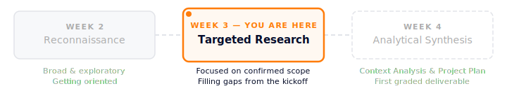

# What's Next: Researching With Direction

You've met your employer. You know what they're asking for, what they care about, and what success looks like to them. Now the question changes — from "what does this organization do?" to "what does my team need to understand to deliver something useful?"

This is the second stage of a three-part research progression in this course:

<!-- INSERT: week3-research-progression.svg -->

---

## What's Different Now

Before the kickoff, you were researching in the dark. You knew the organization and a general project direction, but you didn't know what the employer actually cared about, what had already been tried, or what constraints were in play. Now you do.

That changes what you're looking for. Your research this week should be driven by the specific scope, success criteria, and open questions documented in your Kickoff Summary. If your Kickoff Summary identified gaps — things you still need to find out — this is where you start filling them.

---

## What to Look For

Every project is different, but here are the kinds of questions your research should be answering:

**About the landscape:**
- Who else is doing similar work in this space? What can you learn from how they've approached it?
- What are the major trends, challenges, or shifts in this sector that are relevant to your project?
- Is there published research, industry reports, or case studies that relate directly to what your employer is trying to accomplish?

**About the organization's context:**
- Did anything come up in the kickoff — a merger, a leadership change, a recent initiative — that you need to understand better?
- How does your employer's organization compare to others in their space? Where are they ahead, and where are they behind?

**About the audience or end user:**
- Who will actually be affected by or use what you produce? What do you know about them?
- Are there perspectives you're missing that would change your approach?

You won't answer all of these. Focus on the ones that are most relevant to your specific project scope.

---

## How to Organize What You Find

You're going to use this research next week when you write the Context Analysis & Project Plan — so how you organize now saves you time later.

We recommend keeping a shared document where your team collects findings as you go. For each source or insight, capture:

- What you found and where you found it
- Why it matters to your specific project (not just "it's interesting" — how does it connect to scope, success criteria, or an open question?)
- Whether it's a confirmed fact, a reasonable inference, or something you'd need to verify

That last distinction — fact vs. inference — matters. It's the same skill you practiced in the Kickoff Summary when you separated confirmed information from open questions. In the Context Analysis next week, you'll be graded on the quality of your reasoning, and reasoning built on assumptions you haven't flagged is weaker than reasoning that acknowledges uncertainty.

---

## A Note on AI for Research

AI is a useful research partner here. You can use it to explain unfamiliar terminology or industry concepts, summarize long reports or articles, identify related topics you might not have thought to search for, and pressure-test your early thinking ("here's what we're finding — what are we missing?").

What AI can't do is replace primary research. If your employer mentioned specific competitors, local conditions, or internal challenges, those need real investigation — not AI-generated summaries of generic information. Use AI to accelerate your understanding, not to substitute for actually looking.

---

## Looking Ahead: Week 4

Next week, you'll take everything you've gathered — your Kickoff Summary, your targeted research, and your team's emerging understanding of the project — and synthesize it into the **Context Analysis & Project Plan**. This is your first graded deliverable (10% of your final grade), and it's assessed on the quality of your research, the strength of your evidence-based reasoning, and the clarity of your plan.

The better your research is this week, the stronger your foundation next week. You're not starting from scratch in Week 4 — you're building on what you've already done.
